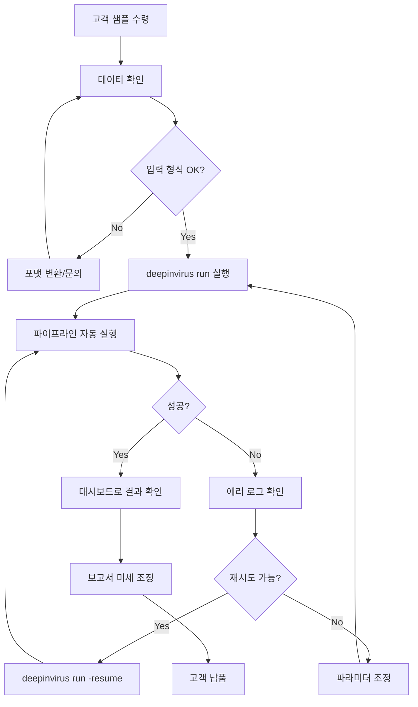
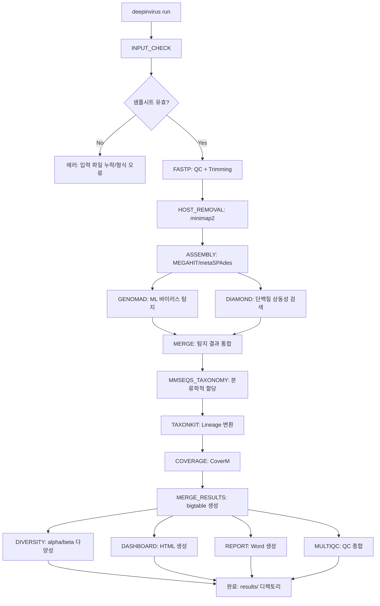
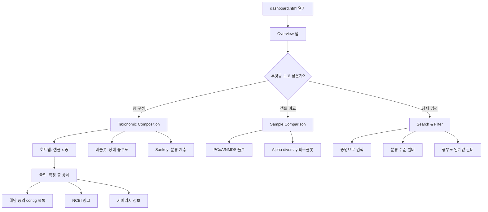
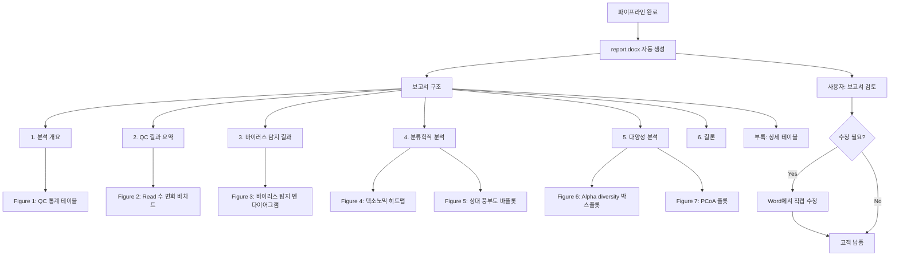
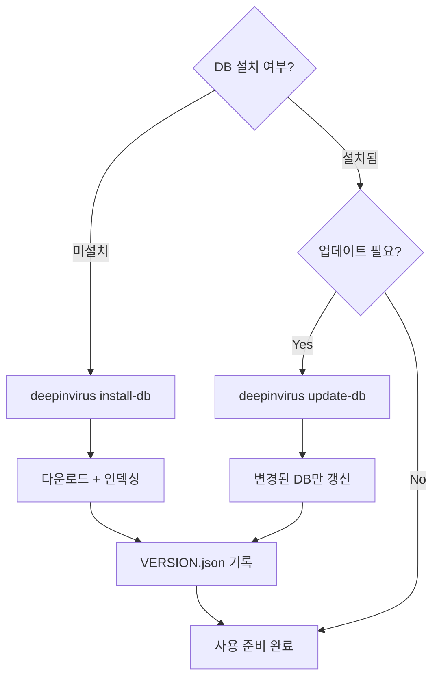
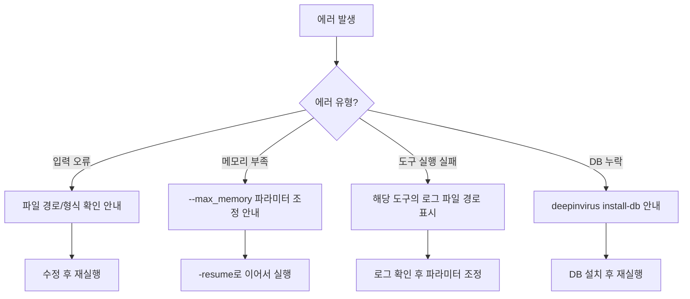

# User Flow (사용자 흐름도) - DeepInvirus

---

## MVP 캡슐

| # | 항목 | 내용 |
|---|------|------|
| 1 | 목표 | Raw FASTQ → 논문/보고서급 결과물 자동 출력 |
| 2 | 페르소나 | 바이러스 메타게노믹스 분석 수탁 서비스 운영자 |
| 3 | 핵심 기능 | FEAT-1: 통합 파이프라인, FEAT-2: 대시보드, FEAT-3: 보고서 |
| 4 | 성공 지표 | 수작업 시간 80% 감소 |

---

## 1. 전체 사용자 여정 (Overview)

---

## 2. FEAT-1: 파이프라인 실행 흐름

---

## 3. FEAT-2: 대시보드 탐색 흐름

---

## 4. FEAT-3: 보고서 생성 흐름

---

## 5. DB 관리 흐름

---

## 6. CLI 명령어 목록

| 명령어 | 용도 | 예시 |
|--------|------|------|
| `deepinvirus run` | 파이프라인 실행 | `deepinvirus run --reads ./data --host insect` |
| `deepinvirus install-db` | DB 설치 | `deepinvirus install-db --db-dir /db` |
| `deepinvirus update-db` | DB 업데이트 | `deepinvirus update-db --component taxonomy` |
| `deepinvirus test` | 테스트 데이터 실행 | `deepinvirus test --threads 8` |
| `deepinvirus list-hosts` | 사용 가능한 host 목록 | `deepinvirus list-hosts` |
| `deepinvirus add-host` | 커스텀 host 추가 | `deepinvirus add-host --name beetle --fasta ref.fa` |

---

## 7. 에러 처리 흐름

