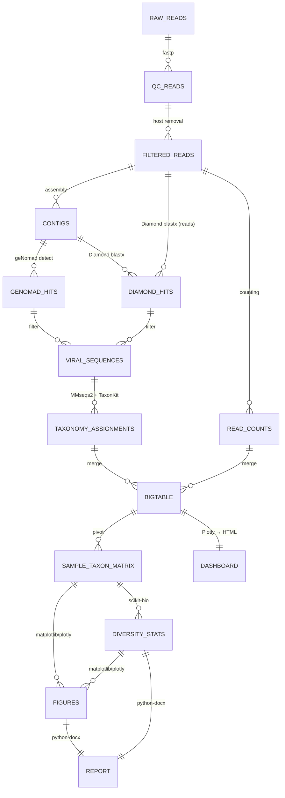

# Database Design (참조 데이터베이스 설계) - DeepInvirus

---

## MVP 캡슐

| # | 항목 | 내용 |
|---|------|------|
| 1 | 목표 | Raw FASTQ → 논문/보고서급 결과물 자동 출력 |
| 2 | 핵심 기능 | FEAT-1: 최신 알고리즘 통합 파이프라인 |
| 3 | 비기능 요구 | 모듈식 설계, DB 독립 업데이트 가능 |

---

## 1. 참조 데이터베이스 구조

```
databases/
├── VERSION.json                    # 전체 DB 버전/날짜 메타정보
│
├── viral_protein/                  # 바이러스 단백질 DB (Diamond용)
│   ├── uniref90_viral.dmnd        # Diamond formatted DB
│   ├── uniref90_viral.fasta       # 원본 FASTA
│   └── metadata.json              # 버전, 다운로드 날짜, 레코드 수
│
├── viral_nucleotide/               # 바이러스 뉴클레오타이드 DB
│   ├── refseq_viral.fasta         # NCBI RefSeq viral genomic
│   ├── refseq_viral.mmseqs/       # MMseqs2 formatted DB
│   └── metadata.json
│
├── genomad_db/                     # geNomad ML 모델 DB
│   ├── genomad_db/                # geNomad 내부 구조
│   └── metadata.json
│
├── taxonomy/                       # 분류학 DB
│   ├── ncbi_taxdump/              # NCBI taxonomy dump
│   │   ├── names.dmp
│   │   ├── nodes.dmp
│   │   └── merged.dmp
│   ├── ictv_vmr.tsv               # ICTV 2024 Virus Metadata Resource
│   ├── taxonkit_data/             # TaxonKit 캐시
│   └── metadata.json
│
├── host_genomes/                   # Host 참조 게놈
│   ├── human/
│   │   ├── genome.fa.gz
│   │   └── genome.mmi             # minimap2 인덱스
│   ├── mouse/
│   ├── insect/                    # 갈색거저리 등
│   └── metadata.json
│
└── contaminants/                   # 오염 서열
    ├── adapters.fa                # Illumina adapters
    ├── phix.fa                    # PhiX spike-in
    └── vectors.fa                 # 클로닝 벡터
```

---

## 2. VERSION.json 스키마

```json
{
  "schema_version": "1.0",
  "created_at": "2026-03-23T00:00:00Z",
  "updated_at": "2026-03-23T00:00:00Z",
  "databases": {
    "viral_protein": {
      "source": "UniRef90 viral subset",
      "version": "2026_01",
      "url": "https://ftp.uniprot.org/pub/databases/uniprot/uniref/uniref90/",
      "downloaded_at": "2026-03-23",
      "record_count": 2500000,
      "format": "diamond"
    },
    "viral_nucleotide": {
      "source": "NCBI RefSeq Viral",
      "version": "release_224",
      "url": "https://ftp.ncbi.nlm.nih.gov/refseq/release/viral/",
      "downloaded_at": "2026-03-23",
      "record_count": 15000,
      "format": "mmseqs2"
    },
    "genomad_db": {
      "source": "geNomad",
      "version": "1.7",
      "url": "https://zenodo.org/records/...",
      "downloaded_at": "2026-03-23"
    },
    "taxonomy": {
      "ncbi_version": "2026-03-20",
      "ictv_version": "VMR_MSL39_v3",
      "downloaded_at": "2026-03-23"
    }
  }
}
```

---

## 3. 데이터 흐름 (ERD 대체)



---

## 4. 핵심 출력 테이블 스키마

### 4.1 bigtable.tsv (통합 분류 테이블)

| 컬럼 | 타입 | 설명 |
|------|------|------|
| seq_id | string | 서열 식별자 |
| sample | string | 샘플명 |
| seq_type | string | read / contig |
| length | int | 서열 길이 |
| detection_method | string | genomad / diamond / both |
| detection_score | float | 탐지 신뢰도 점수 |
| taxid | int | NCBI Taxonomy ID |
| domain | string | 분류: 도메인 |
| phylum | string | 분류: 문 |
| class | string | 분류: 강 |
| order | string | 분류: 목 |
| family | string | 분류: 과 |
| genus | string | 분류: 속 |
| species | string | 분류: 종 |
| ictv_classification | string | ICTV 2024 분류 |
| baltimore_group | string | Baltimore 분류 |
| count | int | 리드 수 |
| rpm | float | Reads Per Million |
| coverage | float | 게놈 커버리지 (contig) |

### 4.2 sample_taxon_matrix.tsv (샘플 x 종 매트릭스)

| 컬럼 | 타입 | 설명 |
|------|------|------|
| taxon | string | 분류학적 이름 (지정 수준) |
| taxid | int | NCBI Taxonomy ID |
| rank | string | 분류 수준 (family/genus/species) |
| {sample_1} | float | 샘플1의 풍부도 (RPM) |
| {sample_2} | float | 샘플2의 풍부도 (RPM) |
| ... | ... | ... |

### 4.3 alpha_diversity.tsv

| 컬럼 | 타입 | 설명 |
|------|------|------|
| sample | string | 샘플명 |
| observed_species | int | 관찰된 종 수 |
| shannon | float | Shannon diversity index |
| simpson | float | Simpson diversity index |
| chao1 | float | Chao1 richness estimator |
| pielou_evenness | float | Pielou's evenness |

### 4.4 beta_diversity.tsv

Bray-Curtis 거리 매트릭스 (대칭 행렬):

| | sample_1 | sample_2 | ... |
|---|---|---|---|
| sample_1 | 0.0 | 0.45 | ... |
| sample_2 | 0.45 | 0.0 | ... |

---

## 5. DB 갱신 전략

### 5.1 자동 갱신 가능한 DB

| DB | 갱신 방법 | 빈도 |
|---|----------|------|
| NCBI Taxonomy | FTP 다운로드 + TaxonKit 처리 | 매 실행 시 (옵션) |
| RefSeq Viral | FTP 다운로드 + MMseqs2 createdb | 6개월 |
| ICTV VMR | ICTV 웹사이트 TSV 다운로드 | 연 1회 |

### 5.2 수동 갱신 필요한 DB

| DB | 이유 | 절차 |
|---|------|------|
| geNomad DB | ML 모델 업데이트 시 호환성 검증 필요 | geNomad 업데이트 노트 확인 후 수동 갱신 |
| UniRef90 Viral | 크기가 크고 Diamond 재인덱싱 필요 | `deepinvirus update-db --component protein` |
| Host genomes | 새 host 종 추가 시 | `deepinvirus add-host --name NAME --fasta FILE` |
