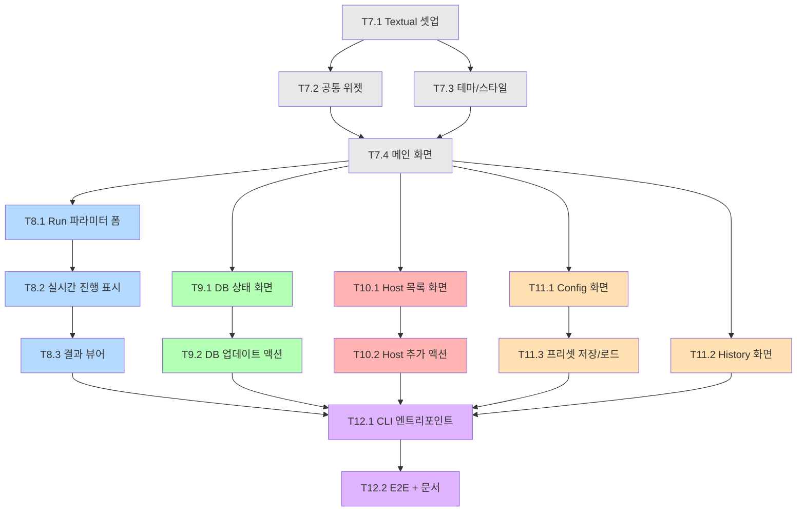

# TASKS: DeepInvirus TUI + 추가 기능

> 파이프라인 핵심 구현(06-tasks.md)이 완료된 상태에서,
> Textual TUI 인터페이스와 4개 추가 기능을 구현합니다.

---

## 마일스톤 개요

| 마일스톤 | 설명 | Phase | 태스크 수 |
|----------|------|-------|----------|
| M7 | TUI 기반 구조 + 메인 화면 | Phase 7 | 4 |
| M8 | Run Analysis 화면 (핵심) | Phase 8 | 3 |
| M9 | Database 관리 화면 | Phase 9 | 2 |
| M10 | Host Genome 관리 화면 | Phase 10 | 2 |
| M11 | Config 프리셋 + History | Phase 11 | 3 |
| M12 | CLI 엔트리포인트 + 통합 | Phase 12 | 2 |

**총 16 태스크**

---

## 병렬 실행 가능 태스크

| Phase | 병렬 가능 태스크 | 설명 |
|-------|-----------------|------|
| Phase 7 | T7.2, T7.3 | 위젯과 테마는 독립 개발 |
| Phase 9~10 | T9.1, T10.1 | DB 화면과 Host 화면은 독립 |
| Phase 11 | T11.1, T11.2 | Config와 History는 독립 |

---

## 의존성 그래프



---

## M7: TUI 기반 구조

### [ ] Phase 7, T7.1: Textual 프레임워크 셋업

**담당**: frontend-specialist

**작업 내용**:
- `pip install textual textual-dev` 의존성 추가 (bin/requirements.txt 업데이트)
- TUI 디렉토리 구조 생성:
  ```
  bin/tui/
  ├── __init__.py
  ├── app.py              # 메인 Textual App 클래스
  ├── screens/
  │   ├── __init__.py
  │   ├── main_screen.py  # 메인 메뉴 화면
  │   ├── run_screen.py   # 분석 실행 화면
  │   ├── db_screen.py    # DB 관리 화면
  │   ├── host_screen.py  # Host genome 화면
  │   ├── config_screen.py # Config 프리셋 화면
  │   └── history_screen.py # 실행 이력 화면
  ├── widgets/
  │   ├── __init__.py
  │   ├── header.py       # 공통 헤더
  │   ├── footer.py       # 공통 푸터 (단축키 안내)
  │   ├── status_bar.py   # DB 상태 바
  │   └── progress.py     # 진행 표시 위젯
  └── styles/
      └── app.tcss        # Textual CSS
  ```
- `bin/tui/app.py` 스켈레톤: Textual App 클래스, 빈 화면 전환 로직

**산출물**:
- `bin/tui/` 전체 디렉토리 구조
- `bin/tui/app.py` (빈 App 클래스)
- `bin/requirements.txt` 업데이트

**완료 조건**:
- [ ] `python -c "from tui.app import DeepInVirusApp"` 성공
- [ ] `textual` import 가능

---

### [ ] Phase 7, T7.2: 공통 위젯 구현 RED→GREEN

**담당**: frontend-specialist

**TDD 사이클**:
1. **RED**: `tests/tui/test_widgets.py`
2. **GREEN**: `bin/tui/widgets/` 구현

**작업 내용**:
- **HeaderWidget**: 로고 + 버전 + DB 상태 표시
- **FooterWidget**: 단축키 안내 (q=종료, r=실행, d=DB, h=도움말)
- **StatusBar**: 현재 DB 버전, host genome 목록, 마지막 실행 시간
- **ProgressWidget**: Nextflow 진행 상황 표시 (step N/M, 경과 시간, 현재 단계명)
- **LogViewer**: 실시간 로그 스트리밍 위젯 (tail -f 스타일)

**산출물**:
- `bin/tui/widgets/header.py`
- `bin/tui/widgets/footer.py`
- `bin/tui/widgets/status_bar.py`
- `bin/tui/widgets/progress.py`
- `bin/tui/widgets/log_viewer.py`
- `tests/tui/test_widgets.py`

**인수 조건**:
- [ ] 각 위젯이 Textual Widget 서브클래스
- [ ] StatusBar가 VERSION.json 읽어서 표시
- [ ] ProgressWidget이 진행률 업데이트 가능

---

### [ ] Phase 7, T7.3: 테마 및 스타일 정의

**담당**: frontend-specialist

**작업 내용**:
- `bin/tui/styles/app.tcss` Textual CSS 작성
- 05-design-system.md 컬러 팔레트 기반:
  - Primary: `#1F77B4` (Deep Blue)
  - Success: `#22C55E`
  - Warning: `#EAB308`
  - Error: `#EF4444`
  - Surface: `#F8F9FA`
  - Text: `#212529`
- 화면별 레이아웃 정의 (Grid/Vertical/Horizontal)
- 버튼, 입력 필드, 테이블 스타일

**산출물**:
- `bin/tui/styles/app.tcss`
- `bin/tui/styles/__init__.py`

**완료 조건**:
- [ ] 유효한 TCSS 문법
- [ ] 05-design-system.md 컬러 팔레트 반영

---

### [ ] Phase 7, T7.4: 메인 화면 구현 RED→GREEN

**담당**: frontend-specialist

**의존성**: T7.2, T7.3

**TDD 사이클**:
1. **RED**: `tests/tui/test_main_screen.py`
2. **GREEN**: `bin/tui/screens/main_screen.py` + `bin/tui/app.py` 완성

**작업 내용**:
```
┌──────────────────────────────────────────────┐
│  DeepInvirus v0.1.0        DB: 2026-03-23    │
├──────────────────────────────────────────────┤
│                                              │
│   ┌──────────────┐  ┌──────────────┐        │
│   │ 🔬 Run       │  │ 🗄️ Database  │        │
│   │ Analysis     │  │ Management   │        │
│   └──────────────┘  └──────────────┘        │
│                                              │
│   ┌──────────────┐  ┌──────────────┐        │
│   │ 🧬 Host      │  │ ⚙️ Config    │        │
│   │ Genome       │  │ Presets      │        │
│   └──────────────┘  └──────────────┘        │
│                                              │
│   ┌──────────────┐  ┌──────────────┐        │
│   │ 📋 History   │  │ ❓ Help      │        │
│   │              │  │              │        │
│   └──────────────┘  └──────────────┘        │
│                                              │
├──────────────────────────────────────────────┤
│  [r]Run [d]Database [h]Host [c]Config [q]Quit│
└──────────────────────────────────────────────┘
```
- 6개 메뉴 버튼 (각 화면으로 전환)
- 키보드 단축키 바인딩
- HeaderWidget + StatusBar + FooterWidget 통합

**산출물**:
- `bin/tui/screens/main_screen.py`
- `bin/tui/app.py` (완성)
- `tests/tui/test_main_screen.py`

**인수 조건**:
- [ ] `python -m tui.app` 으로 TUI 실행 가능
- [ ] 6개 메뉴 버튼 표시
- [ ] 키보드 단축키로 화면 전환
- [ ] Esc 또는 q로 종료

---

## M8: Run Analysis 화면

### [ ] Phase 8, T8.1: 파라미터 입력 폼 RED→GREEN

**담당**: frontend-specialist

**TDD 사이클**:
1. **RED**: `tests/tui/test_run_screen.py`
2. **GREEN**: `bin/tui/screens/run_screen.py`

**작업 내용**:
- 파라미터 입력 폼:
  - **Reads 경로**: 디렉토리 또는 파일 경로 입력 (자동완성)
  - **Host genome**: 드롭다운 (설치된 host 목록에서 선택 + "none")
  - **Assembler**: 라디오 버튼 (megahit / metaspades)
  - **Search mode**: 라디오 버튼 (fast / sensitive)
  - **ML detection**: 체크박스 (geNomad on/off)
  - **Output dir**: 경로 입력 (기본값: ./results)
  - **Threads**: 숫자 입력 (기본값: 시스템 CPU 수)
  - **Config preset**: 드롭다운 (저장된 프리셋 목록)
- 입력 검증: reads 경로 존재 확인, threads 범위 확인
- [Start Analysis] 버튼 / [Back] 버튼

**산출물**:
- `bin/tui/screens/run_screen.py`
- `tests/tui/test_run_screen.py`

**인수 조건**:
- [ ] 모든 02-trd.md params 입력 가능
- [ ] 입력 검증 동작 (잘못된 경로 시 에러 메시지)
- [ ] 설치된 host genome 자동 감지

---

### [ ] Phase 8, T8.2: 실시간 진행 표시 RED→GREEN

**담당**: backend-specialist

**의존성**: T8.1

**TDD 사이클**:
1. **RED**: `tests/tui/test_progress.py`
2. **GREEN**: Nextflow 실행 + 로그 파싱 + 진행률 업데이트

**작업 내용**:
- `bin/tui/runner.py`: Nextflow 프로세스 실행 및 모니터링
  - `class NextflowRunner`:
    - `start(params: dict)`: subprocess로 Nextflow 실행
    - `poll()`: 진행 상황 파싱 (Nextflow stdout/stderr에서 "N of M steps" 추출)
    - `cancel()`: 프로세스 종료
    - `is_running() -> bool`
  - Nextflow `.nextflow.log` 파싱으로 현재 단계 추출
- 실행 화면:
  ```
  ┌─ Running Analysis ─────────────────────────┐
  │                                             │
  │  Sample: GC_Tm, Inf_NB_Tm                   │
  │  Host: insect                               │
  │                                             │
  │  ████████████░░░░░░░░  8/14 (57%)          │
  │  Current: DIAMOND_BLASTX                    │
  │  Elapsed: 01:23:45                          │
  │                                             │
  │  ┌─ Log ─────────────────────────────────┐ │
  │  │ [12:34:56] FASTP completed            │ │
  │  │ [12:45:12] HOST_REMOVAL completed     │ │
  │  │ [13:01:33] MEGAHIT completed          │ │
  │  │ [13:15:22] GENOMAD running...         │ │
  │  └──────────────────────────────────────┘ │
  │                                             │
  │  [Cancel]                    [View Log]     │
  └─────────────────────────────────────────────┘
  ```

**산출물**:
- `bin/tui/runner.py`
- `bin/tui/screens/run_screen.py` (진행 표시 추가)
- `tests/tui/test_progress.py`

**인수 조건**:
- [ ] Nextflow 프로세스를 비동기로 실행
- [ ] 실시간 진행 바 업데이트
- [ ] Cancel 버튼으로 중단 가능
- [ ] 실시간 로그 스트리밍

---

### [ ] Phase 8, T8.3: 결과 뷰어 화면 RED→GREEN

**담당**: frontend-specialist

**의존성**: T8.2

**TDD 사이클**:
1. **RED**: `tests/tui/test_result_viewer.py`
2. **GREEN**: 결과 요약 화면

**작업 내용**:
- 파이프라인 완료 후 결과 요약 화면:
  ```
  ┌─ Analysis Complete ✅ ─────────────────────┐
  │                                             │
  │  Duration: 02:15:33                         │
  │  Samples: 2 (GC_Tm, Inf_NB_Tm)             │
  │  Viruses detected: 15 species               │
  │  Top virus: Densovirus (45.2% RPM)          │
  │                                             │
  │  Output files:                              │
  │  📊 dashboard.html                          │
  │  📄 report.docx                             │
  │  📋 bigtable.tsv                            │
  │                                             │
  │  [Open Dashboard] [Open Folder] [Back]      │
  └─────────────────────────────────────────────┘
  ```
- bigtable.tsv 파싱하여 요약 통계 표시
- "Open Dashboard" → `xdg-open dashboard.html`
- "Open Folder" → `xdg-open results/`

**산출물**:
- `bin/tui/screens/result_screen.py`
- `tests/tui/test_result_viewer.py`

**인수 조건**:
- [ ] 결과 요약 (바이러스 수, top virus, 소요 시간) 표시
- [ ] 출력 파일 목록 표시
- [ ] 외부 프로그램으로 열기 기능

---

## M9: Database 관리 화면

### [ ] Phase 9, T9.1: DB 상태 화면 RED→GREEN

**담당**: backend-specialist

**TDD 사이클**:
1. **RED**: `tests/tui/test_db_screen.py`
2. **GREEN**: `bin/tui/screens/db_screen.py`

**작업 내용**:
```
┌─ Database Management ────────────────────────┐
│                                               │
│  DB Directory: /path/to/databases             │
│                                               │
│  ┌─────────────────────────────────────────┐ │
│  │ Component        Version    Updated     │ │
│  ├─────────────────────────────────────────┤ │
│  │ Viral Protein    2026_01    2026-03-23  │ │
│  │ Viral Nucleotide rel_224    2026-03-23  │ │
│  │ geNomad DB       v1.7       2026-03-23  │ │
│  │ NCBI Taxonomy    2026-03-20 2026-03-23  │ │
│  │ ICTV VMR         MSL39_v3   2026-03-23  │ │
│  │ Host: human      GRCh38     2026-03-23  │ │
│  │ Host: insect     -          Not installed│ │
│  └─────────────────────────────────────────┘ │
│                                               │
│  Total size: 53.2 GB                          │
│                                               │
│  [Install All] [Update Selected] [Back]       │
└───────────────────────────────────────────────┘
```
- VERSION.json 읽어서 테이블 표시
- 각 컴포넌트 설치/미설치 상태
- 디스크 사용량 표시

**산출물**:
- `bin/tui/screens/db_screen.py`
- `tests/tui/test_db_screen.py`

**인수 조건**:
- [ ] VERSION.json에서 DB 상태 로딩
- [ ] 설치/미설치 구분 표시
- [ ] 디스크 사용량 표시

---

### [ ] Phase 9, T9.2: DB 업데이트 액션 RED→GREEN

**담당**: backend-specialist

**의존성**: T9.1

**TDD 사이클**:
1. **RED**: `tests/tui/test_db_actions.py`
2. **GREEN**: DB 설치/업데이트 실행 로직

**작업 내용**:
- DB 화면에서 [Install All] 클릭 시:
  - `bin/install_databases.py` 를 subprocess로 실행
  - ProgressWidget으로 진행 상황 표시
  - 완료 시 테이블 자동 갱신
- 특정 컴포넌트 선택 후 [Update Selected]:
  - `bin/update_databases.py --component {selected}` 실행
  - 선택적 업데이트

**산출물**:
- `bin/tui/screens/db_screen.py` (액션 추가)
- `tests/tui/test_db_actions.py`

**인수 조건**:
- [ ] install_databases.py 비동기 실행
- [ ] 진행 상황 실시간 표시
- [ ] 완료 후 DB 상태 테이블 자동 갱신

---

## M10: Host Genome 관리 화면

### [ ] Phase 10, T10.1: Host 목록 화면 RED→GREEN

**담당**: backend-specialist

**TDD 사이클**:
1. **RED**: `tests/tui/test_host_screen.py`
2. **GREEN**: `bin/tui/screens/host_screen.py`

**작업 내용**:
```
┌─ Host Genome Management ─────────────────────┐
│                                               │
│  ┌─────────────────────────────────────────┐ │
│  │ Name      Species             Size      │ │
│  ├─────────────────────────────────────────┤ │
│  │ human     Homo sapiens        3.1 GB    │ │
│  │ mouse     Mus musculus        2.7 GB    │ │
│  │ insect    Tenebrio molitor    0.4 GB    │ │
│  └─────────────────────────────────────────┘ │
│                                               │
│  [Add Host] [Remove Selected] [Back]          │
└───────────────────────────────────────────────┘
```
- `databases/host_genomes/` 스캔하여 목록 표시
- 각 host의 인덱스 존재 여부 확인 (.mmi 파일)

**산출물**:
- `bin/tui/screens/host_screen.py`
- `tests/tui/test_host_screen.py`

**인수 조건**:
- [ ] 설치된 host genome 목록 표시
- [ ] 인덱스 상태 표시

---

### [ ] Phase 10, T10.2: Host 추가 액션 RED→GREEN

**담당**: backend-specialist

**의존성**: T10.1

**TDD 사이클**:
1. **RED**: `tests/tui/test_host_actions.py`
2. **GREEN**: `bin/add_host.py` + TUI 연결

**작업 내용**:
- `bin/add_host.py` 스크립트:
  - `--name`: host 이름 (예: beetle)
  - `--fasta`: 참조 게놈 FASTA 경로
  - `--db-dir`: DB 디렉토리
  - 동작: FASTA 복사 → minimap2 인덱스 생성 → VERSION.json 업데이트
- TUI에서 [Add Host] 클릭 시:
  - 이름 입력 + FASTA 경로 입력 다이얼로그
  - add_host.py 실행 + 진행 표시
  - 완료 후 목록 갱신

**산출물**:
- `bin/add_host.py`
- `bin/tui/screens/host_screen.py` (액션 추가)
- `tests/tui/test_host_actions.py`

**인수 조건**:
- [ ] FASTA → minimap2 인덱스 자동 생성
- [ ] VERSION.json에 새 host 기록
- [ ] TUI에서 추가 후 목록 자동 갱신

---

## M11: Config 프리셋 + History

### [ ] Phase 11, T11.1: Config 프리셋 화면 RED→GREEN

**담당**: backend-specialist

**TDD 사이클**:
1. **RED**: `tests/tui/test_config_screen.py`
2. **GREEN**: `bin/tui/screens/config_screen.py` + `bin/config_manager.py`

**작업 내용**:
- `bin/config_manager.py`:
  - 프리셋 저장 경로: `~/.deepinvirus/presets/`
  - `save_preset(name: str, params: dict)`: YAML로 저장
  - `load_preset(name: str) -> dict`: YAML에서 로딩
  - `list_presets() -> list[str]`: 프리셋 목록
  - `delete_preset(name: str)`
- Config 화면:
  ```
  ┌─ Config Presets ────────────────────────────┐
  │                                              │
  │  ┌────────────────────────────────────────┐ │
  │  │ Name           Host    Assembler  ML   │ │
  │  ├────────────────────────────────────────┤ │
  │  │ insect_default insect  megahit    Yes  │ │
  │  │ human_fast     human   megahit    No   │ │
  │  │ sensitive_all  human   metaspades Yes  │ │
  │  └────────────────────────────────────────┘ │
  │                                              │
  │  [New] [Edit] [Delete] [Apply to Run] [Back]│
  └──────────────────────────────────────────────┘
  ```

**산출물**:
- `bin/config_manager.py`
- `bin/tui/screens/config_screen.py`
- `tests/tui/test_config_screen.py`

**인수 조건**:
- [ ] YAML 프리셋 저장/로딩
- [ ] 프리셋 목록 표시
- [ ] Run 화면에서 프리셋 선택 가능

---

### [ ] Phase 11, T11.2: 실행 이력 화면 RED→GREEN

**담당**: backend-specialist

**TDD 사이클**:
1. **RED**: `tests/tui/test_history_screen.py`
2. **GREEN**: `bin/tui/screens/history_screen.py` + `bin/history_manager.py`

**작업 내용**:
- `bin/history_manager.py`:
  - 이력 저장 경로: `~/.deepinvirus/history.json`
  - `record_run(params: dict, status: str, duration: float, output_dir: str)`
  - `get_history() -> list[dict]`: 이력 목록 (최근 순)
  - `get_run(run_id: str) -> dict`: 특정 실행 상세
- History 화면:
  ```
  ┌─ Run History ───────────────────────────────┐
  │                                              │
  │  ┌────────────────────────────────────────┐ │
  │  │ Date       Samples  Viruses  Status    │ │
  │  ├────────────────────────────────────────┤ │
  │  │ 2026-03-23 2        15       ✅ Done   │ │
  │  │ 2026-03-22 5        32       ✅ Done   │ │
  │  │ 2026-03-20 3        -        ❌ Failed │ │
  │  └────────────────────────────────────────┘ │
  │                                              │
  │  [View Results] [Re-run] [Delete] [Back]    │
  └──────────────────────────────────────────────┘
  ```
- 파이프라인 완료 시 자동으로 이력 기록
- "Re-run": 동일 파라미터로 재실행
- "View Results": 결과 뷰어 화면으로 전환

**산출물**:
- `bin/history_manager.py`
- `bin/tui/screens/history_screen.py`
- `tests/tui/test_history_screen.py`

**인수 조건**:
- [ ] JSON 이력 저장/로딩
- [ ] 실행 완료 시 자동 기록
- [ ] 재실행 기능 동작

---

### [ ] Phase 11, T11.3: Config 프리셋 저장/로드 통합 RED→GREEN

**담당**: backend-specialist

**의존성**: T11.1, T8.1

**작업 내용**:
- Run 화면에서 프리셋 드롭다운 선택 시 파라미터 자동 채움
- Run 화면에서 [Save as Preset] 버튼 → 현재 설정을 프리셋으로 저장
- Config 화면에서 [Apply to Run] → Run 화면으로 전환 + 파라미터 적용

**산출물**:
- `bin/tui/screens/run_screen.py` (프리셋 통합)
- `bin/tui/screens/config_screen.py` (Apply 기능)
- `tests/tui/test_config_integration.py`

**인수 조건**:
- [ ] 프리셋 → Run 화면 파라미터 자동 채움
- [ ] Run 화면 → 프리셋 저장
- [ ] 양방향 연동

---

## M12: CLI 엔트리포인트 + 통합

### [ ] Phase 12, T12.1: CLI 엔트리포인트 RED→GREEN

**담당**: backend-specialist

**의존성**: 모든 화면 완료

**TDD 사이클**:
1. **RED**: `tests/test_cli.py`
2. **GREEN**: `bin/deepinvirus_cli.py`

**작업 내용**:
- `bin/deepinvirus_cli.py`: Click 기반 CLI 엔트리포인트
  ```bash
  # 인터랙티브 TUI 모드 (기본)
  deepinvirus

  # 직접 실행 모드 (TUI 없이)
  deepinvirus run --reads ./data --host insect --output ./results
  deepinvirus install-db --db-dir /path/to/db
  deepinvirus update-db --component taxonomy
  deepinvirus add-host --name beetle --fasta ref.fa
  deepinvirus list-hosts
  deepinvirus config --list
  deepinvirus history --list
  ```
- TUI 모드: 인자 없이 실행하면 TUI 진입
- CLI 모드: 서브커맨드로 직접 실행 (배치/스크립트 용도)
- `pyproject.toml`에 `[project.scripts]` 엔트리포인트 추가

**산출물**:
- `bin/deepinvirus_cli.py`
- `pyproject.toml` 업데이트 (scripts 엔트리포인트)
- `tests/test_cli.py`

**인수 조건**:
- [ ] `deepinvirus` → TUI 진입
- [ ] `deepinvirus run --reads X` → 직접 실행
- [ ] `deepinvirus --help` → 서브커맨드 목록
- [ ] 모든 서브커맨드 `--help` 동작

---

### [ ] Phase 12, T12.2: 통합 테스트 + 문서 업데이트

**담당**: test-specialist

**의존성**: T12.1

**작업 내용**:
- `tests/tui/test_e2e.py`: TUI 전체 흐름 테스트
  - App 실행 → 메인 화면 렌더링
  - 각 화면 전환 테스트
  - 키보드 단축키 동작
- README.md 업데이트:
  - TUI 사용법 추가
  - 스크린샷/ASCII 아트
  - CLI 서브커맨드 목록
- CHANGELOG.md 업데이트: v0.2.0 (TUI 추가)

**산출물**:
- `tests/tui/test_e2e.py`
- `README.md` (업데이트)
- `CHANGELOG.md` (업데이트)

**인수 조건**:
- [ ] `python -m pytest tests/ -v` 전체 테스트 통과
- [ ] README에 TUI 사용법 포함
- [ ] CHANGELOG에 v0.2.0 기록

---

## 다음 우선순위 작업

1. **T7.1**: Textual 셋업 + 디렉토리 구조
2. **T7.2 + T7.3**: 공통 위젯 + 테마 (병렬)
3. **T7.4**: 메인 화면
4. **T8.1**: Run 파라미터 폼 (가장 핵심)
5. 나머지 화면은 순차/병렬 진행
