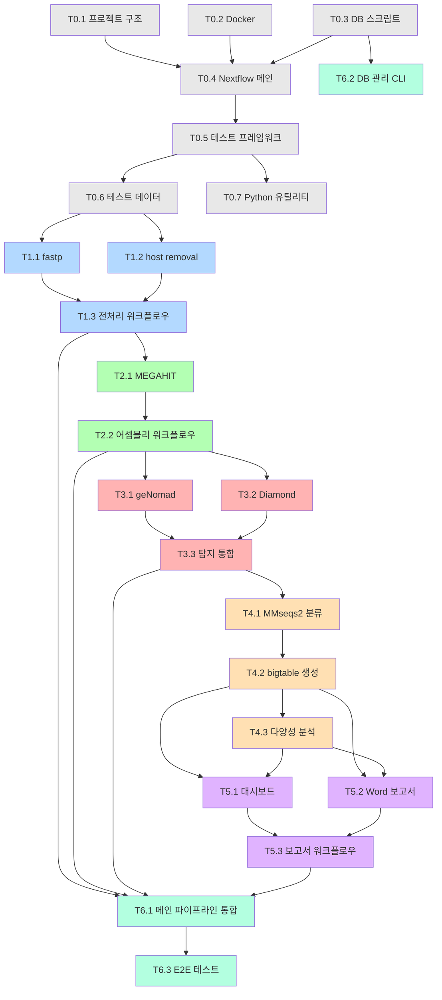

# TASKS: DeepInvirus - 바이러스 메타게노믹스 통합 파이프라인

---

## 마일스톤 개요

| 마일스톤 | 설명 | Phase | 태스크 수 |
|----------|------|-------|----------|
| M0 | 프로젝트 셋업 + 인프라 | Phase 0 | 5 |
| M0.5 | 테스트 프레임워크 + 테스트 데이터 | Phase 0 | 3 |
| M1 | QC + 전처리 모듈 | Phase 1 | 3 |
| M2 | 어셈블리 모듈 | Phase 2 | 2 |
| M3 | 바이러스 탐지 모듈 | Phase 3 | 3 |
| M4 | 분류 + 다양성 모듈 | Phase 4 | 3 |
| M5 | 대시보드 + 보고서 | Phase 5 | 3 |
| M6 | 통합 + DB 관리 | Phase 6 | 3 |

---

## 병렬 실행 가능 태스크

| Phase | 병렬 가능 태스크 | 설명 |
|-------|-----------------|------|
| Phase 0 | T0.1, T0.2, T0.3 | 프로젝트 구조, Docker, DB 설치 스크립트 독립 |
| Phase 1 | T1.1, T1.2 | fastp와 host removal 독립 개발 가능 |
| Phase 3 | T3.1, T3.2 | geNomad와 Diamond 독립 개발 가능 |
| Phase 4 | T4.2, T4.3 | 분류와 다양성은 별도 입력으로 독립 테스트 |
| Phase 5 | T5.1, T5.2 | 대시보드와 보고서 독립 개발 가능 |

---

## 의존성 그래프



---

## M0: 프로젝트 셋업

### [ ] Phase 0, T0.1: 프로젝트 디렉토리 구조 초기화

**담당**: backend-specialist

**작업 내용**:
- 07-coding-convention.md의 프로젝트 구조에 따라 디렉토리 생성
- `main.nf` 스켈레톤 (빈 워크플로우)
- `nextflow.config` 기본 설정 (params, profiles)
- `nextflow_schema.json` 초기화
- `bin/requirements.txt` 의존성 목록

**산출물**:
- `DeepInvirus/main.nf`
- `DeepInvirus/nextflow.config`
- `DeepInvirus/modules/local/` (빈 디렉토리)
- `DeepInvirus/bin/requirements.txt`
- `DeepInvirus/conf/base.config`

**완료 조건**:
- [ ] 프로젝트 구조가 07-coding-convention.md와 일치
- [ ] `nextflow run main.nf --help` 실행 시 파라미터 목록 표시

---

### [ ] Phase 0, T0.2: Docker 컨테이너 정의

**담당**: backend-specialist

**작업 내용**:
- 모듈별 Dockerfile 작성 (qc, assembly, detect, classify, reporting)
- `conf/docker.config` 작성 (process → container 매핑)
- `conf/singularity.config` 작성

**산출물**:
- `containers/qc/Dockerfile`
- `containers/assembly/Dockerfile`
- `containers/detect/Dockerfile`
- `containers/classify/Dockerfile`
- `containers/reporting/Dockerfile`
- `conf/docker.config`
- `conf/singularity.config`

**완료 조건**:
- [ ] 각 Dockerfile이 빌드 성공
- [ ] `docker build -t deepinvirus/qc:1.0.0 containers/qc/` 성공

---

### [ ] Phase 0, T0.3: DB 설치 스크립트 작성

**담당**: backend-specialist

**작업 내용**:
- `bin/install_databases.py` 작성 (04-database-design.md 참조)
- NCBI RefSeq Viral, UniRef90 Viral, geNomad DB, NCBI taxonomy, ICTV VMR 다운로드
- `VERSION.json` 생성 로직
- Host genome 다운로드 (human, mouse, insect)

**산출물**:
- `bin/install_databases.py`
- `bin/update_databases.py`

**완료 조건**:
- [ ] `python bin/install_databases.py --db-dir /tmp/test_db --dry-run` 성공
- [ ] VERSION.json 스키마 검증

---

### [ ] Phase 0, T0.4: Nextflow 메인 파이프라인 스켈레톤

**담당**: backend-specialist

**작업 내용**:
- `main.nf`에 전체 워크플로우 구조 정의 (stub process들)
- 서브워크플로우 파일 생성 (preprocessing, assembly, detection, classification, reporting)
- `conf/test.config` 테스트 프로필 정의

**산출물**:
- `main.nf` (완전한 워크플로우 구조, stub 구현)
- `subworkflows/preprocessing.nf`
- `subworkflows/assembly.nf`
- `subworkflows/detection.nf`
- `subworkflows/classification.nf`
- `subworkflows/reporting.nf`

**완료 조건**:
- [ ] `nextflow run main.nf -stub -profile test` 성공 (모든 process stub 통과)

---

### [ ] Phase 0, T0.5: 테스트 프레임워크 설정

**담당**: test-specialist

**작업 내용**:
- pytest 설정 (`pyproject.toml` 또는 `pytest.ini`)
- Ruff/Black 린터 설정
- `tests/` 디렉토리 구조 생성
- CI 설정 파일 (GitHub Actions 또는 로컬 스크립트)

**산출물**:
- `pyproject.toml` (pytest, ruff, black 설정)
- `tests/conftest.py`
- `tests/modules/`
- `tests/pipeline/`
- `.github/workflows/test.yml` (선택)

**완료 조건**:
- [ ] `pytest tests/ -v` 실행 가능 (테스트 0개여도 에러 없이)
- [ ] `ruff check bin/` 실행 가능

---

### [ ] Phase 0, T0.6: 테스트 데이터 준비

**담당**: test-specialist

**작업 내용**:
- 소규모 테스트 FASTQ 생성 (< 1MB, paired-end)
- 예상 출력 파일 생성 (bigtable 포맷, diversity TSV 등)
- 테스트용 경량 참조 DB 준비

**산출물**:
- `tests/data/reads/test_R1.fastq.gz`
- `tests/data/reads/test_R2.fastq.gz`
- `tests/data/expected/bigtable.tsv`
- `tests/data/expected/alpha_diversity.tsv`
- `tests/data/db/` (경량 테스트 DB)

**완료 조건**:
- [ ] 테스트 FASTQ가 유효한 FASTQ 포맷
- [ ] 예상 출력 파일이 04-database-design.md 스키마와 일치

---

### [ ] Phase 0, T0.7: Python 유틸리티 기반 모듈

**담당**: backend-specialist

**작업 내용**:
- `bin/utils/__init__.py` 패키지 설정
- `bin/utils/taxonomy.py` - 분류학 처리 유틸리티
- `bin/utils/visualization.py` - matplotlib/plotly 공통 설정
- `bin/utils/docx_builder.py` - Word 보고서 빌더 기초

**산출물**:
- `bin/utils/__init__.py`
- `bin/utils/taxonomy.py`
- `bin/utils/visualization.py`
- `bin/utils/docx_builder.py`

**완료 조건**:
- [ ] `python -c "from utils import taxonomy"` 성공
- [ ] 기본 함수 스켈레톤 존재

---

## M1: QC + 전처리 모듈

### [ ] Phase 1, T1.1: fastp QC 모듈 RED→GREEN

**담당**: backend-specialist

**Git Worktree 설정**:
```bash
git worktree add ../DeepInvirus-phase1-qc -b phase/1-qc
cd ../DeepInvirus-phase1-qc
```

**TDD 사이클**:

1. **RED**: 테스트 작성 (실패 확인)
   ```bash
   # 테스트 파일: tests/modules/test_fastp.py
   # Nextflow stub: nextflow run modules/local/fastp.nf -stub -profile test
   pytest tests/modules/test_fastp.py -v  # Expected: FAILED
   ```

2. **GREEN**: 최소 구현 (테스트 통과)
   ```bash
   # 구현 파일: modules/local/fastp.nf
   nextflow run modules/local/fastp.nf -stub -profile test  # Expected: OK
   pytest tests/modules/test_fastp.py -v  # Expected: PASSED
   ```

3. **REFACTOR**: 리팩토링 (테스트 유지)

**산출물**:
- `modules/local/fastp.nf` (Nextflow process)
- `tests/modules/test_fastp.py` (출력 포맷 검증)

**인수 조건**:
- [ ] 테스트 먼저 작성됨 (RED 확인)
- [ ] fastp stub 실행 성공
- [ ] 출력: `*_R1.trimmed.fastq.gz`, `*_R2.trimmed.fastq.gz`, `*.fastp.json`
- [ ] main 브랜치 병합 완료

---

### [ ] Phase 1, T1.2: Host removal 모듈 RED→GREEN

**담당**: backend-specialist

**Git Worktree 설정**:
```bash
git worktree add ../DeepInvirus-phase1-hostremoval -b phase/1-hostremoval
cd ../DeepInvirus-phase1-hostremoval
```

**TDD 사이클**:

1. **RED**: `tests/modules/test_host_removal.py` 작성
   ```bash
   pytest tests/modules/test_host_removal.py -v  # Expected: FAILED
   ```

2. **GREEN**: `modules/local/host_removal.nf` 구현
   ```bash
   pytest tests/modules/test_host_removal.py -v  # Expected: PASSED
   ```

**산출물**:
- `modules/local/host_removal.nf`
- `tests/modules/test_host_removal.py`

**인수 조건**:
- [ ] minimap2 + samtools 기반 host read 제거
- [ ] 출력: `*_R1.filtered.fastq.gz`, `*_R2.filtered.fastq.gz`
- [ ] host genome 인덱스 자동 생성

---

### [ ] Phase 1, T1.3: 전처리 서브워크플로우 통합 RED→GREEN

**담당**: backend-specialist

**의존성**: T1.1, T1.2 완료 필요

**Git Worktree 설정**:
```bash
git worktree add ../DeepInvirus-phase1-preprocessing -b phase/1-preprocessing
cd ../DeepInvirus-phase1-preprocessing
```

**TDD 사이클**:

1. **RED**: `tests/pipeline/test_preprocessing.py` 작성
2. **GREEN**: `subworkflows/preprocessing.nf` 구현 (fastp → host_removal 연결)

**산출물**:
- `subworkflows/preprocessing.nf`
- `tests/pipeline/test_preprocessing.py`

**인수 조건**:
- [ ] fastp → host_removal 연결 동작
- [ ] 테스트 데이터로 전체 전처리 흐름 완료

---

## M2: 어셈블리 모듈

### [ ] Phase 2, T2.1: MEGAHIT 어셈블리 모듈 RED→GREEN

**담당**: backend-specialist

**Git Worktree 설정**:
```bash
git worktree add ../DeepInvirus-phase2-assembly -b phase/2-assembly
cd ../DeepInvirus-phase2-assembly
```

**TDD 사이클**:

1. **RED**: `tests/modules/test_megahit.py` 작성
2. **GREEN**: `modules/local/megahit.nf` 구현

**산출물**:
- `modules/local/megahit.nf`
- `tests/modules/test_megahit.py`

**인수 조건**:
- [ ] 출력: `contigs.fa` (FASTA 포맷)
- [ ] 어셈블리 통계 출력 (N50, contig 수 등)

---

### [ ] Phase 2, T2.2: 어셈블리 서브워크플로우 RED→GREEN

**담당**: backend-specialist

**의존성**: T2.1 완료 필요

**TDD 사이클**:
1. **RED**: `tests/pipeline/test_assembly.py`
2. **GREEN**: `subworkflows/assembly.nf`

**산출물**:
- `subworkflows/assembly.nf`
- `modules/local/metaspades.nf` (옵션, params.assembler로 선택)

**인수 조건**:
- [ ] `params.assembler = 'megahit'` 또는 `'metaspades'` 선택 가능
- [ ] 어셈블리 통계 TSV 출력

---

## M3: 바이러스 탐지 모듈

### [ ] Phase 3, T3.1: geNomad ML 탐지 모듈 RED→GREEN

**담당**: backend-specialist

**Git Worktree 설정**:
```bash
git worktree add ../DeepInvirus-phase3-genomad -b phase/3-genomad
cd ../DeepInvirus-phase3-genomad
```

**TDD 사이클**:
1. **RED**: `tests/modules/test_genomad.py`
2. **GREEN**: `modules/local/genomad.nf` + `bin/parse_genomad.py`

**산출물**:
- `modules/local/genomad.nf`
- `bin/parse_genomad.py` (geNomad 출력 → 표준 TSV 변환)
- `tests/modules/test_genomad.py`

**인수 조건**:
- [ ] geNomad end-to-end 모드 실행
- [ ] 출력: 표준 TSV (seq_id, score, label, taxonomy)
- [ ] `bin/parse_genomad.py` 단위 테스트 통과

---

### [ ] Phase 3, T3.2: Diamond blastx 모듈 RED→GREEN

**담당**: backend-specialist

**Git Worktree 설정**:
```bash
git worktree add ../DeepInvirus-phase3-diamond -b phase/3-diamond
cd ../DeepInvirus-phase3-diamond
```

**TDD 사이클**:
1. **RED**: `tests/modules/test_diamond.py`
2. **GREEN**: `modules/local/diamond.nf` + `bin/parse_diamond.py`

**산출물**:
- `modules/local/diamond.nf`
- `bin/parse_diamond.py` (Diamond 출력 → 표준 TSV 변환)
- `tests/modules/test_diamond.py`

**인수 조건**:
- [ ] Diamond blastx 실행 (UniRef90 viral DB)
- [ ] 출력: 표준 TSV (seq_id, subject_id, evalue, bitscore, taxid)

---

### [ ] Phase 3, T3.3: 탐지 결과 통합 모듈 RED→GREEN

**담당**: backend-specialist

**의존성**: T3.1, T3.2 - **Mock 사용으로 독립 개발 가능**

**Mock 설정**:
```python
# tests/fixtures/mock_detection.py
MOCK_GENOMAD_TSV = "seq1\t0.95\tvirus\tCaudovirales\n"
MOCK_DIAMOND_TSV = "seq1\tUniRef90_ABC\t1e-50\t200\t12345\n"
```

**TDD 사이클**:
1. **RED**: `tests/modules/test_merge_detection.py`
2. **GREEN**: `bin/merge_detection.py`

**산출물**:
- `bin/merge_detection.py`
- `modules/local/merge_detection.nf`
- `tests/modules/test_merge_detection.py`

**인수 조건**:
- [ ] geNomad + Diamond 결과를 단일 테이블로 통합
- [ ] detection_method 컬럼: genomad / diamond / both
- [ ] 중복 서열 처리 로직 (intersection/union)

---

## M4: 분류 + 다양성 모듈

### [ ] Phase 4, T4.1: MMseqs2 분류 + TaxonKit 모듈 RED→GREEN

**담당**: backend-specialist

**Git Worktree 설정**:
```bash
git worktree add ../DeepInvirus-phase4-classify -b phase/4-classify
cd ../DeepInvirus-phase4-classify
```

**TDD 사이클**:
1. **RED**: `tests/modules/test_classification.py`
2. **GREEN**: `modules/local/mmseqs_taxonomy.nf` + `modules/local/taxonkit.nf`

**산출물**:
- `modules/local/mmseqs_taxonomy.nf`
- `modules/local/taxonkit.nf`
- `tests/modules/test_classification.py`

**인수 조건**:
- [ ] MMseqs2 taxonomy LCA 모드 실행
- [ ] TaxonKit으로 7-rank lineage 변환
- [ ] ICTV 2024 VMR 테이블과 매핑

---

### [ ] Phase 4, T4.2: bigtable 생성 스크립트 RED→GREEN

**담당**: backend-specialist

**Mock 설정**:
```python
# tests/fixtures/mock_classification.py
MOCK_TAXONOMY_TSV = """seq_id\ttaxid\tdomain\tphylum\tclass\torder\tfamily\tgenus\tspecies
seq1\t12345\tViruses\tUroviricota\tCaudoviricetes\tCaudovirales\tMyoviridae\tT4virus\tT4phage
"""
```

**TDD 사이클**:
1. **RED**: `tests/modules/test_merge_results.py`
2. **GREEN**: `bin/merge_results.py`

**산출물**:
- `bin/merge_results.py`
- `modules/local/merge_results.nf`
- `tests/modules/test_merge_results.py`

**인수 조건**:
- [ ] 04-database-design.md의 bigtable.tsv 스키마와 일치
- [ ] sample_taxon_matrix.tsv (샘플 x 종 피벗) 생성
- [ ] RPM 정규화 적용

---

### [ ] Phase 4, T4.3: 다양성 분석 스크립트 RED→GREEN

**담당**: backend-specialist

**TDD 사이클**:
1. **RED**: `tests/modules/test_diversity.py`
2. **GREEN**: `bin/calc_diversity.py`

**산출물**:
- `bin/calc_diversity.py`
- `modules/local/diversity.nf`
- `tests/modules/test_diversity.py`

**인수 조건**:
- [ ] Alpha diversity: Shannon, Simpson, Chao1, Pielou's evenness
- [ ] Beta diversity: Bray-Curtis 거리 매트릭스
- [ ] PCoA 좌표 계산
- [ ] 출력 포맷이 04-database-design.md 스키마와 일치
- [ ] 단위 테스트 커버리지 ≥ 80%

---

## M5: 대시보드 + 보고서

### [ ] Phase 5, T5.1: 동적 HTML 대시보드 RED→GREEN

**담당**: frontend-specialist

**Git Worktree 설정**:
```bash
git worktree add ../DeepInvirus-phase5-dashboard -b phase/5-dashboard
cd ../DeepInvirus-phase5-dashboard
```

**TDD 사이클**:
1. **RED**: `tests/modules/test_dashboard.py`
2. **GREEN**: `bin/generate_dashboard.py` + `assets/dashboard_template.html`

**산출물**:
- `bin/generate_dashboard.py`
- `assets/dashboard_template.html` (Jinja2 + Plotly.js)
- `modules/local/dashboard.nf`
- `tests/modules/test_dashboard.py`

**인수 조건**:
- [ ] 05-design-system.md의 레이아웃/탭 구조 구현
- [ ] 히트맵, 바플롯, Sankey, PCoA 시각화 포함
- [ ] 필터링/검색 인터랙션 동작
- [ ] 단독 HTML 파일 (외부 의존성 없음, Plotly.js CDN 허용)

---

### [ ] Phase 5, T5.2: Word 보고서 자동 생성 RED→GREEN

**담당**: backend-specialist

**Git Worktree 설정**:
```bash
git worktree add ../DeepInvirus-phase5-report -b phase/5-report
cd ../DeepInvirus-phase5-report
```

**TDD 사이클**:
1. **RED**: `tests/modules/test_report.py`
2. **GREEN**: `bin/generate_report.py` + `assets/report_template.docx`

**산출물**:
- `bin/generate_report.py`
- `assets/report_template.docx`
- `modules/local/report.nf`
- `tests/modules/test_report.py`

**인수 조건**:
- [ ] 05-design-system.md의 보고서 구조 구현
- [ ] Figure 자동 삽입 (히트맵, 바플롯, PCoA 등)
- [ ] 테이블 자동 삽입 (QC 통계, 주요 바이러스 목록)
- [ ] 한글 폰트 (맑은 고딕) 적용
- [ ] 유효한 .docx 파일 생성 확인

---

### [ ] Phase 5, T5.3: 보고서 서브워크플로우 통합 RED→GREEN

**담당**: backend-specialist

**의존성**: T5.1, T5.2 완료 필요

**TDD 사이클**:
1. **RED**: `tests/pipeline/test_reporting.py`
2. **GREEN**: `subworkflows/reporting.nf`

**산출물**:
- `subworkflows/reporting.nf`
- `tests/pipeline/test_reporting.py`

**인수 조건**:
- [ ] bigtable → figures + dashboard + report 자동 생성
- [ ] MultiQC 통합 (QC 종합 리포트)

---

## M6: 통합 + DB 관리

### [ ] Phase 6, T6.1: 메인 파이프라인 전체 통합 RED→GREEN

**담당**: backend-specialist

**Git Worktree 설정**:
```bash
git worktree add ../DeepInvirus-phase6-integration -b phase/6-integration
cd ../DeepInvirus-phase6-integration
```

**TDD 사이클**:
1. **RED**: `tests/pipeline/test_full_pipeline.py`
2. **GREEN**: `main.nf` 전체 워크플로우 연결

**산출물**:
- `main.nf` (완전한 파이프라인)
- `tests/pipeline/test_full_pipeline.py`

**인수 조건**:
- [ ] `nextflow run main.nf -profile test,docker` 전체 파이프라인 성공
- [ ] 모든 출력 파일 생성 (02-trd.md의 Output 구조)
- [ ] `-resume` 재시작 동작 확인

---

### [ ] Phase 6, T6.2: DB 관리 CLI RED→GREEN

**담당**: backend-specialist

**TDD 사이클**:
1. **RED**: `tests/test_db_cli.py`
2. **GREEN**: `bin/install_databases.py`, `bin/update_databases.py` 완성

**산출물**:
- `bin/install_databases.py` (완성)
- `bin/update_databases.py` (완성)
- `tests/test_db_cli.py`

**인수 조건**:
- [ ] `deepinvirus install-db --dry-run` 동작
- [ ] `deepinvirus update-db --component taxonomy --dry-run` 동작
- [ ] VERSION.json 생성/업데이트

---

### [ ] Phase 6, T6.3: E2E 테스트 + 문서화

**담당**: test-specialist

**의존성**: T6.1 완료 필요

**TDD 사이클**:
1. **RED**: `tests/pipeline/test_e2e.py`
2. **GREEN**: 실제 테스트 데이터로 전체 파이프라인 검증

**산출물**:
- `tests/pipeline/test_e2e.py`
- `README.md`
- `CHANGELOG.md`

**인수 조건**:
- [ ] 테스트 데이터로 전체 파이프라인 실행 성공
- [ ] 모든 출력 파일이 예상 포맷과 일치
- [ ] README.md: 설치, 사용법, 예제 포함
- [ ] CHANGELOG.md: v1.0.0 릴리즈 노트

---

## 다음 우선순위 작업

1. **T0.1**: 프로젝트 디렉토리 구조 초기화
2. **T0.2**: Docker 컨테이너 정의 (T0.1과 병렬 가능)
3. **T0.3**: DB 설치 스크립트 (T0.1과 병렬 가능)
4. **T0.4**: Nextflow 메인 스켈레톤
5. **T0.5 + T0.6**: 테스트 프레임워크 + 데이터
